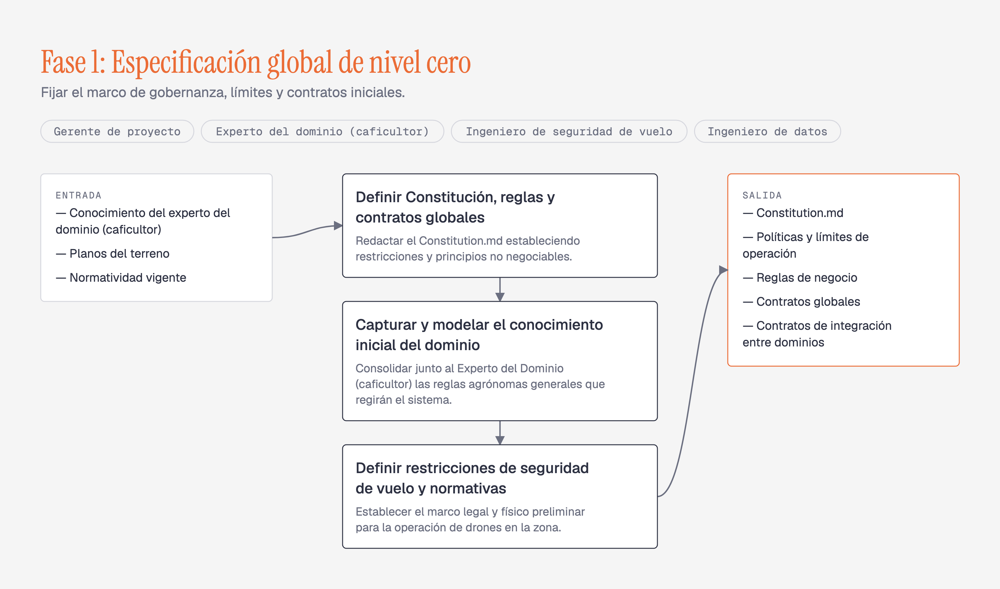

# Modelo de Procesos — SPEM 2.0 Playground

Editor web que produce los diagramas SPEM 2.0 del documento *Modelo de procesos*
(sistema de riego autónomo guiado por drones para caficultura). El modelo se edita en un
formulario, el diagrama se redibuja solo, y cada **Fase** se exporta como PNG o PDF para
pegarla en el documento.

Las cuatro **Fases** del documento vienen precargadas.



## Uso

```bash
npm install
npm run dev        # editor en http://localhost:5173
```

| Comando | Qué hace |
|---|---|
| `npm run dev` | Servidor de desarrollo |
| `npm run build` | Build de producción en `dist/` |
| `npm test` | Los 20 tests (layout, validación, mover, slug) |
| `npm run typecheck` | TypeScript sin emitir |
| `npm run figuras` | Regenera `figuras/*.png` a 3x con Chrome headless (macOS) |
| `npm run fuentes` | Regenera `src/fuentes.css`, las tres tipografías en base64 |

En el editor: pestañas para cambiar de **Fase**, panel izquierdo para editar **Roles**,
**Tareas**, **Entrada** y **Salida**, y en la barra superior **Exportar PNG**,
**Exportar PDF**, **Exportar JSON**, **Importar JSON** y **Restablecer**.

El PDF abre el diálogo de impresión del navegador; ahí se elige «Guardar como PDF».

## Cómo está armado

```
src/
  layout.ts       Función pura: una Fase → coordenadas absolutas. Toda la geometría.
  Diagrama.tsx    Dibuja ese layout como un <svg>. No calcula ningún número.
  Editor.tsx      Panel de edición; ListaEditable.tsx para las cuatro listas.
  validacion.ts   Frontera de confianza: valida JSON importado y localStorage.
  almacen.ts      Autoguardado; un valor corrupto cae al seed.
  exportar.ts     PNG (canvas 3x) y PDF (print), sin dependencias.
  fuentes.css     Las tres caras en base64, para que el PNG no caiga a fuente del sistema.
  seed.ts         Las cuatro Fases del documento fuente.
figuras/          Las cuatro figuras finales, listas para el documento.
```

Dos dependencias de runtime: `react` y `react-dom`.

Los tests cubren dos costuras: el layout (relaciones geométricas, nunca píxeles fijos) y
la validación del modelo. Los componentes, el export y la persistencia no tienen tests,
por decisión del spec.

## Decisiones

| ADR | Decisión |
|---|---|
| [0001](docs/adr/0001-no-method-content-process-split.md) | Sin capa de Method Content: cada **Fase** lleva su propio texto |
| [0002](docs/adr/0002-solo-las-tareas-son-nodos.md) | Solo las **Tareas** son nodos; **Entrada**/**Salida** son paneles, **Roles** chips |
| [0003](docs/adr/0003-svg-con-exportacion-nativa.md) | SVG con exportación nativa, sin html2canvas ni jsPDF |
| [0004](docs/adr/0004-sin-hyperframes-solo-css.md) | Animación solo con CSS |
| [0005](docs/adr/0005-defaults-del-style-guide.md) | Los defaults del style guide se aceptan sin personalizar |

El vocabulario del dominio está en [CONTEXT.md](CONTEXT.md). El spec y los tickets, en
`.scratch/spem-playground/`.
