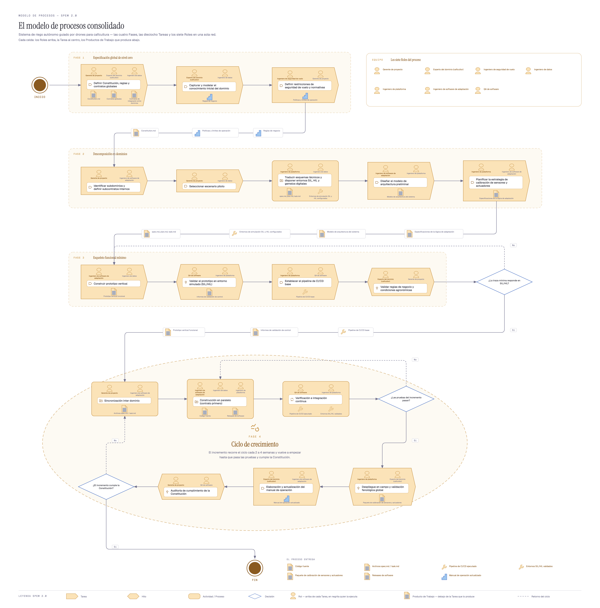
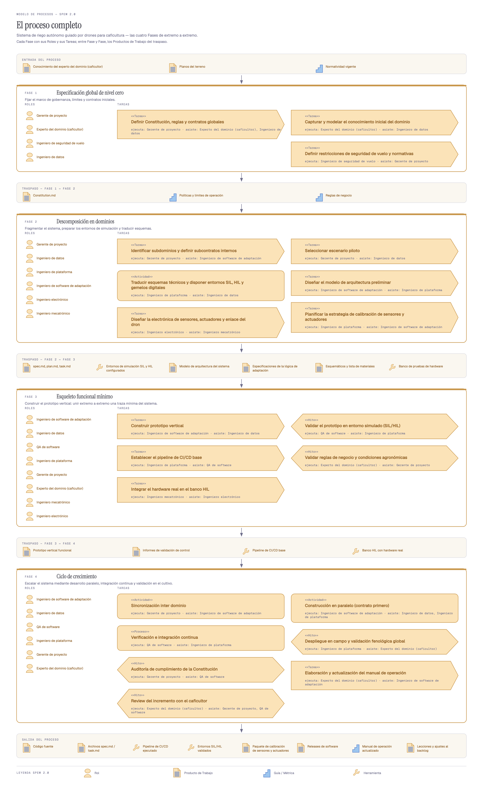
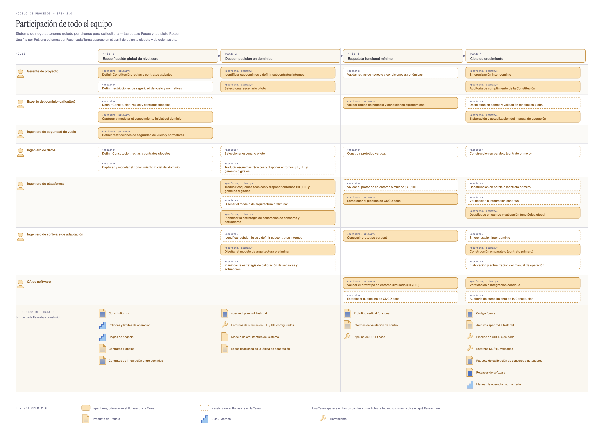
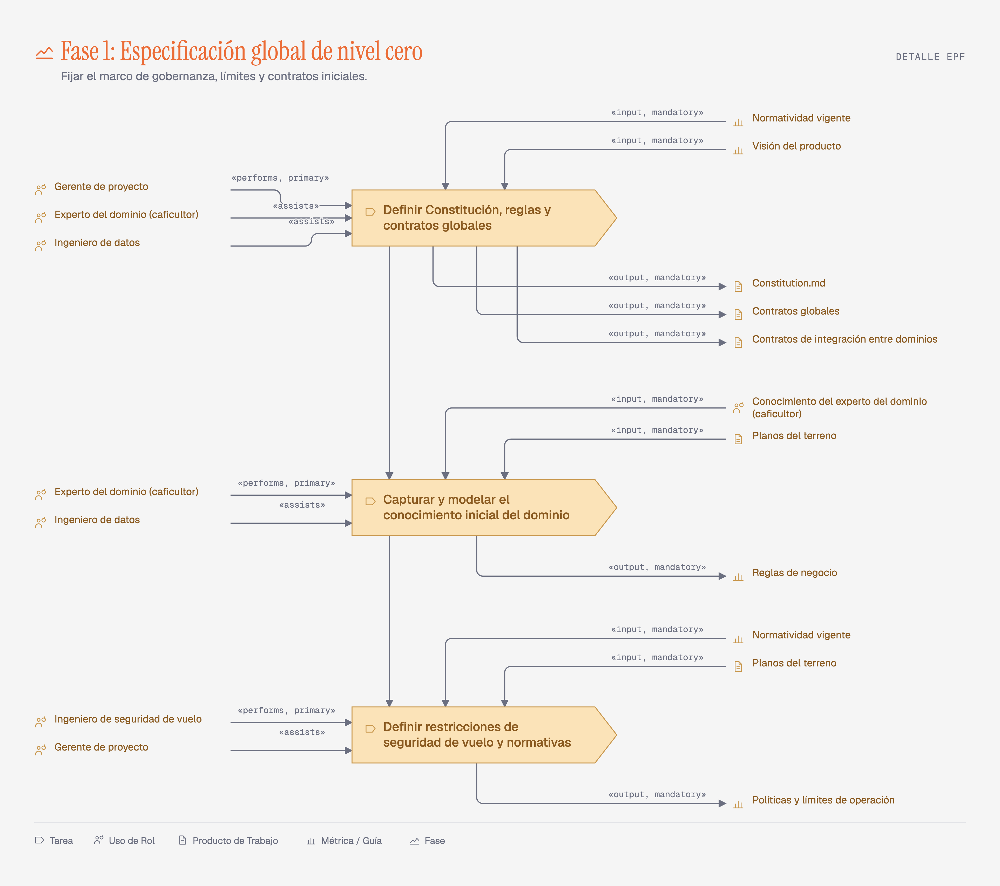

# Modelo de Procesos — SPEM 2.0 Playground

**App en vivo: https://sjunka.github.io/spem-playground/**

Editor web que produce los diagramas SPEM 2.0 del documento *Modelo de procesos*
(sistema de riego autónomo guiado por drones para caficultura). El modelo se edita en un
formulario, el diagrama se redibuja solo, y cada figura se exporta como PNG o PDF para
pegarla en el documento.

Las cuatro **Fases** del documento vienen precargadas, y cada una produce **cinco
vistas** —**Resumen**, **Flujo**, **Roles**, **Descomposición** y **Detalle EPF**—:
veinte figuras, en la notación de EPF Composer / SPEM Designer.


## La figura consolidada

El modelo entero como una **red**, en la composición del *process model* de EPF
Composer: cada celda lleva sus **Roles** arriba, la **Tarea** al centro y sus
**Productos de Trabajo** abajo; las **Fases** 1 a 3 avanzan en cascada con el traspaso
sobre el conector, y la **Fase 4** se repite dentro de la elipse hasta que el
incremento pasa las pruebas y cumple la **Constitution.md**. Ver [ADR-0010](docs/adr/0010-figura-consolidada.md).



## La figura general del proceso

Para abrir el documento hace falta lo contrario a una **Vista**: una sola imagen con
el sistema completo, de la que las veinte figuras por **Fase** sean el desglose. Se
generan **dos versiones** y se escoge cuál va al *paper*. Ver [ADR-0009](docs/adr/0009-figura-general-del-proceso.md).

**Versión A — cadena de Fases.** Las cuatro **Fases** apiladas con sus **Roles** y sus
**Tareas**, y entre una y la siguiente los **Productos de Trabajo** del traspaso.
Responde *qué pasa, en qué orden y qué se entrega entre etapas*.



**Versión B — carriles por Rol.** Una fila por **Rol** y una columna por **Fase**: cada
**Tarea** aparece en el carril de quien la ejecuta y en el de quien asiste. Responde
*quién participa, y en qué*.



| Vista | Qué responde | Cómo la dibuja |
|---|---|---|
| **Resumen** | ¿Qué es esta **Fase**? | Chips de **Roles**, panel de **Entrada**, **Tareas**, panel de **Salida** |
| **Flujo** | ¿Qué consume y produce cada **Tarea**? | Cadena vertical de **Tareas**, con `«input, mandatory»` y `«output, mandatory»` |
| **Roles** | ¿Quién ejecuta y quién asiste? | `«performs, primary»` a la izquierda, `«assists»` a la derecha |
| **Descomposición** | ¿De qué se compone? | La **Fase** como raíz, sus **Tareas** con `«include»` |
| **Detalle EPF** | ¿Cómo lo ve EPF Composer? | Tres bandas: **Roles**, cadena de **Tareas**, **Productos de Trabajo** |


La **Vista** **Detalle EPF** reproduce el *activity detail diagram* de EPF Composer:
los **Roles** a la izquierda con `«performs, primary»` y `«assists»`, la cadena de
**Tareas** al centro, y los **Productos de Trabajo** a la derecha, la **Entrada**
encima de su **Tarea** y la **Salida** debajo. Ver [ADR-0008](docs/adr/0008-vista-detalle-epf.md).



El reparto de **Roles** y **Productos de Trabajo** por **Tarea** que traen las cuatro
**Fases** precargadas es una inferencia del editor, no un dato del documento fuente:
conviene revisarlo antes de pegar ninguna figura. Ver [ADR-0006](docs/adr/0006-cuatro-vistas-por-fase.md).

## Uso

```bash
npm install
npm run dev        # editor en http://localhost:5173
```

| Comando | Qué hace |
|---|---|
| `npm run dev` | Servidor de desarrollo |
| `npm run build` | Build de producción en `dist/` |
| `npm test` | Los 83 tests (layout, vistas, formas, validación, seed, roles, mover, slug) |
| `npm run typecheck` | TypeScript sin emitir |
| `npm run figuras` | Regenera las veinte `figuras/*.png` a 3x con Chrome headless (macOS) |
| `npm run consolidado` | Genera `figuras/consolidado-modelo-de-procesos.png`: las dieciocho **Tareas** en una sola red |
| `npm run general` | Genera las dos versiones de la figura general: `figuras/general-a-*.png` y `general-b-*.png` |
| `npm run epf` | Genera `figuras/epf-fase-*.png`: la figura EPF de cada **Fase**, sin abrir el editor |
| `npm run fuentes` | Regenera `src/fuentes.css`, las tres tipografías en base64 |

Cada **Tarea** y cada ítem de **Entrada** y **Salida** lleva uno de los quince iconos de
la notación SPEM 2.0, elegido desde el editor. Los **Roles** llevan el icono Role y el
título de la **Fase** el icono Phase, ambos fijos. Cada figura cierra con una leyenda de
los tipos que esa **Fase** usa.

En el editor: pestañas para cambiar de **Fase**, sub-pestañas para cambiar de vista
—cambiar de **Fase** conserva la vista—, panel izquierdo para editar **Roles**,
**Tareas**, **Entrada** y **Salida** de la **Fase**, y dentro de cada **Tarea** una
sección plegada con sus propios **Roles** (no participa / `perform` / `assist`) y sus
**Entrada** y **Salida** —con un selector de tipo SPEM por elemento—, y en la barra superior **Exportar PNG**,
**Exportar PDF**, **Exportar JSON**, **Importar JSON** y **Restablecer**.

El PDF abre el diálogo de impresión del navegador; ahí se elige «Guardar como PDF».

## Cómo está armado

```
src/
  iconos.ts       Los quince tipos de SPEM 2.0 como paths, con sus etiquetas.
  layout.ts       Función pura: una Fase y una vista → coordenadas absolutas.
  consolidado.ts  La red completa: las dieciocho Tareas, sus decisiones y su ciclo.
  general.ts      Las dos versiones de la figura general: el Modelo entero → SVG.
  epf-svg.ts      Paleta, glifos y codos de EPF Composer, compartidos por las figuras EPF.
  formas.ts       El contorno de un nodo según su Tipo SPEM: chevron, hexágono, caja.
  roles.ts        Cascada al renombrar o borrar un Rol de la Fase.
  Diagrama.tsx    Dibuja ese layout como un <svg>. No calcula ningún número.
  Editor.tsx      Panel de edición; ListaEditable.tsx para las cuatro listas.
  SelectorIcono.tsx  <select> nativo de los quince tipos, con preview del glifo.
  validacion.ts   Frontera de confianza: valida JSON importado y localStorage.
  almacen.ts      Autoguardado; la clave lleva la versión y un sello del seed,
                  así un deploy que cambie las Fases arranca de ellas.
  exportar.ts     PNG (canvas 3x) y PDF (print), sin dependencias.
  fuentes.css     Las tres caras en base64, para que el PNG no caiga a fuente del sistema.
  seed.ts         Las cuatro Fases del documento fuente.
figuras/          Las veinte figuras por Fase y las dos generales, listas para el documento.
```

Dos dependencias de runtime: `react` y `react-dom`.

Los tests cubren tres costuras: el layout de las cinco vistas (relaciones geométricas,
nunca píxeles fijos), la validación del modelo —con la migración de v1 y v2 a v3— y las
invariantes del reparto por **Tarea** del seed. Los componentes, el export y la persistencia no tienen tests,
por decisión del spec.

## Decisiones

| ADR | Decisión |
|---|---|
| [0001](docs/adr/0001-no-method-content-process-split.md) | Sin capa de Method Content: cada **Fase** lleva su propio texto |
| [0002](docs/adr/0002-solo-las-tareas-son-nodos.md) | Solo las **Tareas** son nodos (reemplazado por 0006; vigente en **Resumen**) |
| [0003](docs/adr/0003-svg-con-exportacion-nativa.md) | SVG con exportación nativa, sin html2canvas ni jsPDF |
| [0004](docs/adr/0004-sin-hyperframes-solo-css.md) | Animación solo con CSS |
| [0005](docs/adr/0005-defaults-del-style-guide.md) | Los defaults del style guide se aceptan sin personalizar |
| [0006](docs/adr/0006-cuatro-vistas-por-fase.md) | Cuatro vistas por **Fase**; reemplaza a 0002 |
| [0007](docs/adr/0007-notacion-epf-composer.md) | Las figuras adoptan la notación de EPF Composer / SPEM Designer |
| [0008](docs/adr/0008-vista-detalle-epf.md) | Una quinta vista, **Detalle EPF**, con el layout de EPF |
| [0009](docs/adr/0009-figura-general-del-proceso.md) | Una figura general del proceso completo, en dos versiones |
| [0010](docs/adr/0010-figura-consolidada.md) | La figura consolidada: una red con decisiones y ciclo, no una cascada |

El vocabulario del dominio está en [CONTEXT.md](CONTEXT.md). El spec y los tickets, en
`.scratch/spem-playground/`.
