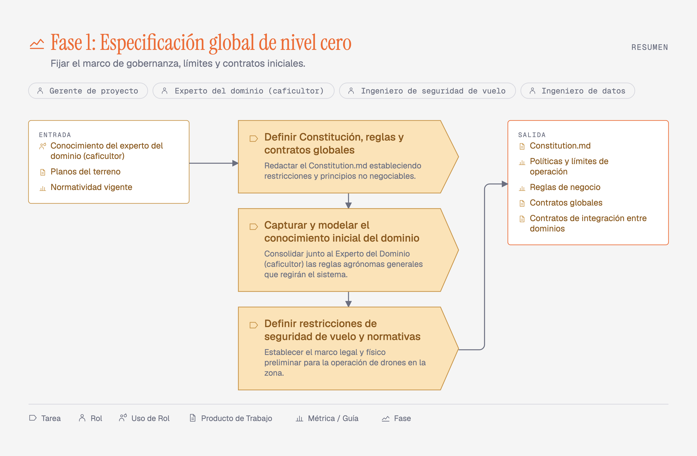
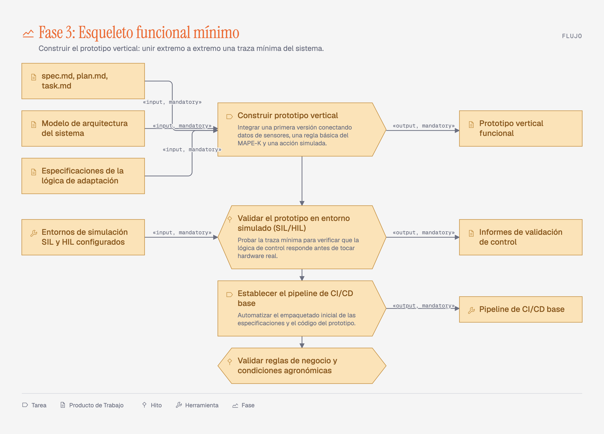

# Modelo de Procesos — SPEM 2.0 Playground

Editor web que produce los diagramas SPEM 2.0 del documento *Modelo de procesos*
(sistema de riego autónomo guiado por drones para caficultura). El modelo se edita en un
formulario, el diagrama se redibuja solo, y cada figura se exporta como PNG o PDF para
pegarla en el documento.

Las cuatro **Fases** del documento vienen precargadas, y cada una produce **cuatro
vistas** —**Resumen**, **Flujo**, **Roles** y **Descomposición**—: dieciséis figuras.



| Vista | Qué responde | Cómo la dibuja |
|---|---|---|
| **Resumen** | ¿Qué es esta **Fase**? | Chips de **Roles**, panel de **Entrada**, **Tareas**, panel de **Salida** |
| **Flujo** | ¿Qué consume y produce cada **Tarea**? | Cadena vertical de **Tareas**, con `«input, mandatory»` y `«output, mandatory»` |
| **Roles** | ¿Quién ejecuta y quién asiste? | `«perform»` a la izquierda, `«assist»` a la derecha |
| **Descomposición** | ¿De qué se compone? | La **Fase** como raíz, sus **Tareas** con `«include»` |



El reparto de **Roles** y **Productos de Trabajo** por **Tarea** que traen las cuatro
**Fases** precargadas es una inferencia del editor, no un dato del documento fuente:
conviene revisarlo antes de pegar ninguna figura. Ver [ADR-0006](docs/adr/0006-cuatro-vistas-por-fase.md).

## Uso

```bash
npm install
npm run dev        # editor en http://localhost:5173
```

| Comando | Qué hace |
|---|---|
| `npm run dev` | Servidor de desarrollo |
| `npm run build` | Build de producción en `dist/` |
| `npm test` | Los 67 tests (layout, vistas, validación, seed, roles, mover, slug) |
| `npm run typecheck` | TypeScript sin emitir |
| `npm run figuras` | Regenera las dieciséis `figuras/*.png` a 3x con Chrome headless (macOS) |
| `npm run fuentes` | Regenera `src/fuentes.css`, las tres tipografías en base64 |

Cada **Tarea** y cada ítem de **Entrada** y **Salida** lleva uno de los quince iconos de
la notación SPEM 2.0, elegido desde el editor. Los **Roles** llevan el icono Role y el
título de la **Fase** el icono Phase, ambos fijos. Cada figura cierra con una leyenda de
los tipos que esa **Fase** usa.

En el editor: pestañas para cambiar de **Fase**, sub-pestañas para cambiar de vista
—cambiar de **Fase** conserva la vista—, panel izquierdo para editar **Roles**,
**Tareas**, **Entrada** y **Salida** de la **Fase**, y dentro de cada **Tarea** una
sección plegada con sus propios **Roles** (no participa / `perform` / `assist`) y sus
**Entrada** y **Salida** —con un selector de tipo SPEM por elemento—, y en la barra superior **Exportar PNG**,
**Exportar PDF**, **Exportar JSON**, **Importar JSON** y **Restablecer**.

El PDF abre el diálogo de impresión del navegador; ahí se elige «Guardar como PDF».

## Cómo está armado

```
src/
  iconos.ts       Los quince tipos de SPEM 2.0 como paths, con sus etiquetas.
  layout.ts       Función pura: una Fase y una vista → coordenadas absolutas.
  roles.ts        Cascada al renombrar o borrar un Rol de la Fase.
  Diagrama.tsx    Dibuja ese layout como un <svg>. No calcula ningún número.
  Editor.tsx      Panel de edición; ListaEditable.tsx para las cuatro listas.
  SelectorIcono.tsx  <select> nativo de los quince tipos, con preview del glifo.
  validacion.ts   Frontera de confianza: valida JSON importado y localStorage.
  almacen.ts      Autoguardado; la clave lleva la versión y un sello del seed,
                  así un deploy que cambie las Fases arranca de ellas.
  exportar.ts     PNG (canvas 3x) y PDF (print), sin dependencias.
  fuentes.css     Las tres caras en base64, para que el PNG no caiga a fuente del sistema.
  seed.ts         Las cuatro Fases del documento fuente.
figuras/          Las dieciséis figuras finales, listas para el documento.
```

Dos dependencias de runtime: `react` y `react-dom`.

Los tests cubren tres costuras: el layout de las cuatro vistas (relaciones geométricas,
nunca píxeles fijos), la validación del modelo —con la migración de v1 y v2 a v3— y las
invariantes del reparto por **Tarea** del seed. Los componentes, el export y la persistencia no tienen tests,
por decisión del spec.

## Decisiones

| ADR | Decisión |
|---|---|
| [0001](docs/adr/0001-no-method-content-process-split.md) | Sin capa de Method Content: cada **Fase** lleva su propio texto |
| [0002](docs/adr/0002-solo-las-tareas-son-nodos.md) | Solo las **Tareas** son nodos (reemplazado por 0006; vigente en **Resumen**) |
| [0003](docs/adr/0003-svg-con-exportacion-nativa.md) | SVG con exportación nativa, sin html2canvas ni jsPDF |
| [0004](docs/adr/0004-sin-hyperframes-solo-css.md) | Animación solo con CSS |
| [0005](docs/adr/0005-defaults-del-style-guide.md) | Los defaults del style guide se aceptan sin personalizar |
| [0006](docs/adr/0006-cuatro-vistas-por-fase.md) | Cuatro vistas por **Fase**; reemplaza a 0002 |

El vocabulario del dominio está en [CONTEXT.md](CONTEXT.md). El spec y los tickets, en
`.scratch/spem-playground/`.
