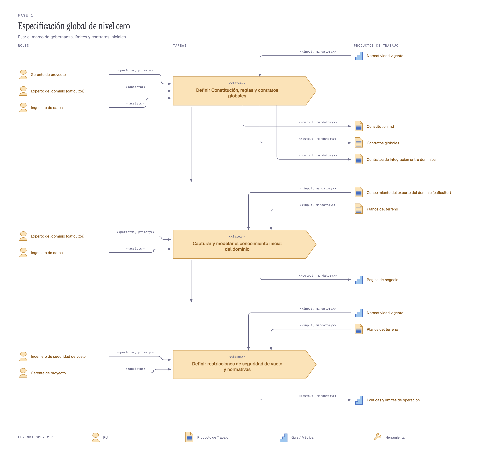
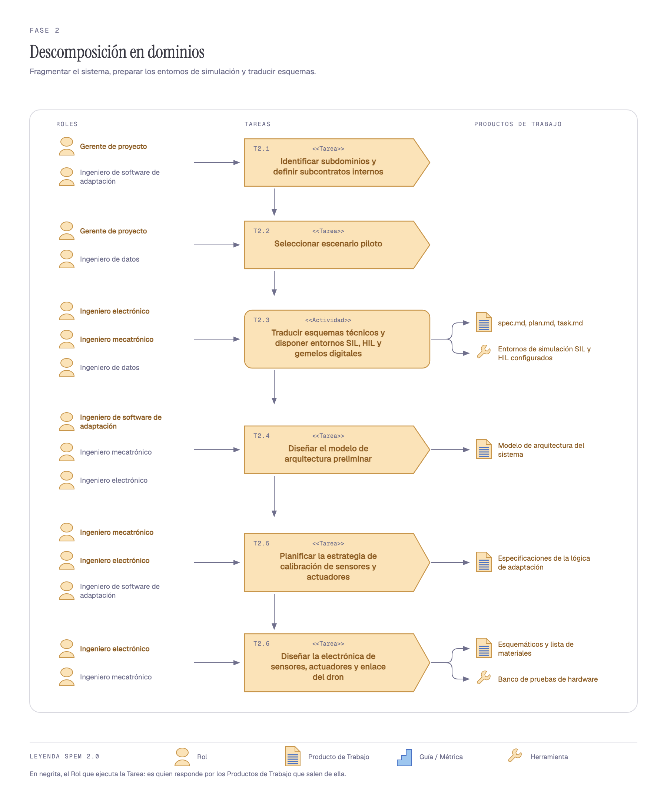
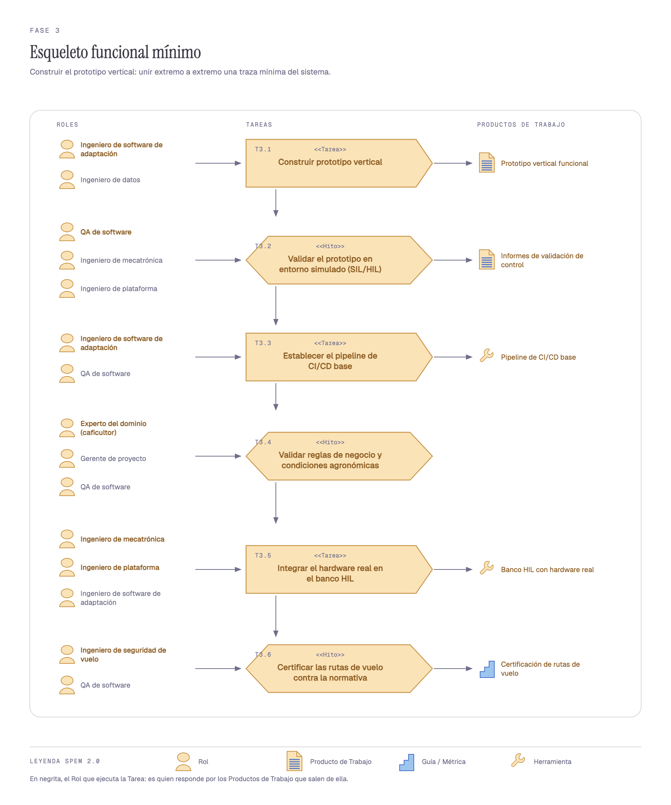
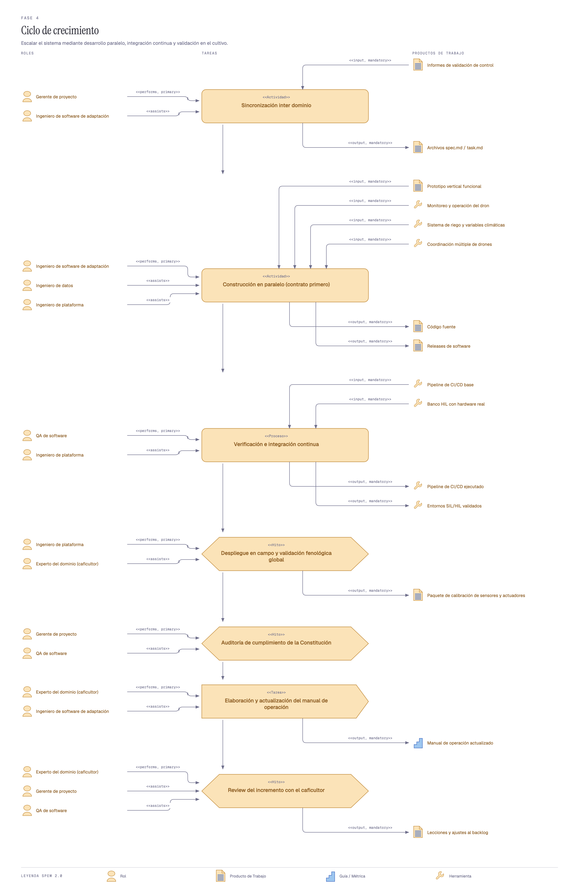

# Metodología con enfoque Spec-Driven y de simulación para el desarrollo de un sistema ciberfísico de riego autónomo

**Modelo de procesos en SPEM 2.0 — sistema de riego autónomo guiado por drones para caficultura**

---

## I. Introducción

El proyecto construye un sistema ciberfísico: una red de sensores en el terreno, un
conjunto de drones que sobrevuela el cultivo y una lógica de control que decide cuándo
y cuánto regar. Ni el software ni el hardware se pueden desarrollar por separado —una
regla de riego mal escrita se manifiesta como una válvula que no abre, y un sensor mal
calibrado se manifiesta como una decisión de control equivocada—, y por eso el proyecto
necesita un modelo de procesos explícito antes que una lista de tareas.

Este documento adapta la metodología propuesta en *«Metodología con enfoque BDD y MDD
para el desarrollo de proyectos IoT»* al caso concreto de nuestro sistema. Conserva su
armazón —ciclos cortos, colaboración multidisciplinar, artefactos como eje de la
comunicación, y SPEM 2.0 como notación del modelo de procesos— y sustituye sus dos
instrumentos por los que nuestro dominio exige. La sección II explica esa sustitución;
las secciones IV y V describen el modelo resultante, Fase por Fase y Tarea por Tarea.

---

## II. Los dos enfoques que orientan la metodología

El documento base se apoya en dos enfoques complementarios: **BDD**, que fija un
lenguaje natural común (Gherkin) entre los actores técnicos y los que no lo son, y
**MDD**, que parte de modelos del sistema y los transforma en artefactos ejecutables.
Nosotros mantenemos los dos objetivos y cambiamos las herramientas.

### A. Spec-Driven Development, en el lugar de BDD

BDD resuelve un problema de comunicación: que el experto del negocio y el equipo
técnico estén hablando del mismo comportamiento. En nuestro proyecto ese problema
existe igual —el caficultor sabe cuándo regar y el equipo no—, pero el escenario
Gherkin no es el mejor vehículo: lo que hay que acordar con él no son solo casos de
prueba, son **restricciones que no se pueden violar** (cuánta agua, a qué hora, sobre
qué lote, con qué margen de seguridad de vuelo).

Adoptamos entonces una cadena documental donde la especificación manda sobre el código:

```
Constitution.md → spec.md → plan.md → task.md → código → verificación
```

Cada eslabón nace del anterior y el código es el último, nunca el primero. El
`Constitution.md` es el documento de la Fase 1 que fija los principios y restricciones
no negociables del sistema, y se audita en cada incremento de la Fase 4 (Tarea T4.5). El
efecto es el mismo que persigue BDD —una especificación legible por quien no programa,
y anterior a la implementación— con un artefacto que además gobierna el proyecto entero.

La segunda mitad de BDD, la validación por parte de quien conoce el negocio, se conserva
tal cual y se lleva más lejos: el **caficultor no es un stakeholder externo al que se le
consulta, es un Rol del modelo que ejecuta Tareas propias** (T1.2, T3.4, T4.6 y T4.7) y
que controla dos puertas de decisión del proceso.

### B. Modelos ejecutables de simulación, en el lugar de MDD

MDD parte de modelos y los transforma en código. En un sistema ciberfísico la
transformación automática rinde poco: el valor del modelo no está en generar el
`firmware`, está en **poder ejecutar el sistema antes de que el hardware exista**.

Nuestros modelos son, por tanto, entornos de ejecución:

- **SIL** (*software in the loop*): valida la lógica de control sin hardware.
- **HIL** (*hardware in the loop*): la valida con sensores y actuadores reales en el bucle.
- **Gemelo digital**: réplica simulada del terreno y sus dispositivos, donde cada
  incremento se verifica antes de desplegarlo en campo.
- **MAPE-K** (*Monitor, Analyze, Plan, Execute, Knowledge*): el bucle de adaptación sobre
  el que se construye la lógica de riego, y que da al modelo de arquitectura su forma.

Se conservan de MDD la validación previa de los modelos y las pruebas automatizadas
contra ellos; se abandona la generación automática de código.

### C. Por qué la sustitución

| Eje | Documento base | Este proyecto | Motivo |
|---|---|---|---|
| Lenguaje común | Escenarios BDD en Gherkin | Cadena `Constitution.md → spec → plan → task` | Hay que acordar restricciones, no solo casos |
| Papel del experto | Stakeholder consultado | Rol que ejecuta Tareas y cierra puertas | El criterio agronómico es una condición de avance |
| Modelos | MDD con generación de código | SIL, HIL y gemelo digital | El riesgo está en el mundo físico, no en la traducción |
| Ciclo | Sprints de 2 a 3 semanas | Incrementos de 2 a 4 semanas | Calibrar en campo no cabe en dos semanas |

---

## III. Diseño del modelo de procesos

Siguiendo la taxonomía de métodos de diseño que usa el documento base, el modelo se
describe por seis componentes.

### A. Ciclo

El proyecto tiene dos regímenes distintos y el modelo los separa.

La **Iteración 0** —Fases 1, 2 y 3— ocurre **una sola vez** y ocupa las semanas 1 a 14.
No es un sprint: es el arranque que produce la gobernanza, los contratos, los entornos
de simulación y el primer prototipo vertical. Corre en cascada porque no tiene sentido
iterar sobre una arquitectura que aún no se ha escrito.

El **Ciclo de crecimiento** —Fase 4— es el estado permanente del proyecto a partir de
la semana 15. Cada incremento dura de 2 a 4 semanas: se construye, se verifica, se
despliega, se muestra al caficultor, y lo aprendido reordena el backlog del siguiente.

### B. Colaboración

El equipo son **ocho Roles**, cinco de software y de gestión y tres del mundo físico:

| Rol | De qué responde |
|---|---|
| Gerente de proyecto | Gobernanza, contratos, alcance y auditoría de cumplimiento |
| Experto del dominio (caficultor) | Reglas agronómicas, validación en campo y manual de operación |
| Ingeniero de seguridad de vuelo | Marco legal y físico de la operación de los drones |
| Ingeniero de datos | Modelado del dato del cultivo y de la telemetría |
| Ingeniero de software de adaptación | Lógica MAPE-K, arquitectura y construcción del sistema |
| Ingeniero electrónico | Esquemáticos, componentes y enlace del dron |
| Ingeniero mecatrónico | Integración física, calibración y banco HIL |
| QA de software | Verificación, pipeline y pruebas automatizadas |

La diferencia con el documento base está en los dos últimos ingenieros y en el
caficultor. El documento base agrupa a todos los perfiles en un *Agile Team* y trata al
desarrollador de dispositivos IoT como un rol más dentro de él. Aquí la electrónica y la
mecatrónica son **trabajo de ingeniería propio**, con Tareas, artefactos y un banco de
pruebas de hardware que existe antes que el software que lo comanda; y el caficultor
tiene Tareas propias en vez de una silla en la reunión.

### C. Artefactos

Los Productos de Trabajo del modelo se agrupan en cuatro familias:

- **De gobernanza:** `Constitution.md`, contratos globales, contratos de integración
  entre dominios, políticas y límites de operación, reglas de negocio.
- **De especificación:** `spec.md`, `plan.md`, `task.md`, modelo de arquitectura del
  sistema, especificaciones de la lógica de adaptación.
- **Del mundo físico:** esquemáticos y lista de materiales, banco de pruebas de hardware,
  banco HIL con hardware real, red de sensores instalada, firmware de sensores y
  actuadores, paquete de calibración.
- **De producto y aprendizaje:** prototipo vertical funcional, informes de validación de
  control, pipeline de CI/CD, releases de software, manual de operación, lecciones y
  ajustes al backlog.

### D. Uso recomendado

Proyecto pequeño a mediano, de 5 a 10 personas, con riesgo técnico **alto** —más alto que
el que estima el documento base, porque el sistema no falla solo por software: falla por
un sensor descalibrado, por un dron que pierde enlace o por una regla agronómica que en
el papel funcionaba y en la ladera no.

### E. Madurez

Media. SPEM 2.0 y los ciclos incrementales están bien difundidos; la combinación con la
cadena Spec-Driven y con validación en SIL/HIL es reciente. Se apoya en lenguaje natural
para que cualquier participante entienda el modelo sin formación previa en la notación.

### F. Flexibilidad

Alta en el orden interno de las Tareas y en el contenido de cada incremento; **baja en
las cuatro puertas de decisión**, que son condiciones de avance y no negociables. La
granularidad es un documento principal por ítem, ampliado por documentos satélite.

---

## IV. Propuesta del modelo de procesos

El modelo se expresa en **SPEM 2.0**, el metamodelo de OMG para procesos de ingeniería de
software y sistemas, en la composición de *process model* de EPF Composer. Se usa el
subconjunto mínimo de la especificación: Fase, Tarea, Rol, Producto de Trabajo, Hito,
Actividad y Proceso.

El modelo completo son **cuatro Fases, veintiuna Tareas y ocho Roles** en una sola red.


*Figura 1. Modelo de procesos consolidado.* La figura completa ocupa varias
páginas a tamaño legible; las Figuras 2 a 5 la descomponen Fase por Fase.


### Cómo se lee la figura

La figura es autonarrativa: no hace falta el texto para saber quién hace qué y qué sale
de ahí.

- **Cada Fase es una columna** que se lee hacia abajo; las Fases se suceden hacia la
  derecha. Sobre el canal que une una columna con la siguiente se apilan los Productos de
  Trabajo del traspaso: **la Salida de una Fase es la Entrada de la que sigue**.
- **Cada celda es una Tarea** y lleva tres bandas: los **Roles** arriba —en negrita el que
  la ejecuta y responde por sus artefactos, en contorno los que asisten—, la **Tarea** al
  centro con su código, y sus **Productos de Trabajo** abajo.
- **Los rombos son puertas de decisión.** Ninguna es decorativa: cada una tiene su rama
  «No» dibujada, con el retorno a la Tarea concreta donde se rehace el trabajo.
- **La elipse es la Fase 4**, que se repite hasta que el incremento pasa las pruebas y
  cumple la `Constitution.md`.
- **La regla superior es el tiempo** en semanas, y el panel lateral el plan de releases.

---

## V. El proceso, Fase por Fase

### A. Inicio y Fase 1 — Especificación global de nivel cero *(semanas 1 a 3)*

> **Objetivo:** fijar el marco de gobernanza, los límites y los contratos iniciales.

El proceso comienza como en el documento base: con una reunión, pero no entre un analista
de negocio y unos stakeholders, sino entre el **Gerente de proyecto** y el **caficultor**.
De ese encuentro no sale un backlog: sale el `Constitution.md`, el documento que fija lo
que el sistema no puede violar por mucho que cambie el alcance. En paralelo, el
**Ingeniero de seguridad de vuelo** delimita dónde y cuándo puede volar un dron, que es
la otra restricción dura del proyecto.



*Figura 2. Fase 1, Especificación global de nivel cero.* Los Roles a la izquierda, la cadena de Tareas al centro y lo que sale de cada una a la derecha. En negrita, el Rol que ejecuta la Tarea: es quien responde por sus Productos de Trabajo.

| Código | Tarea | Ejecuta | Asiste | Entrada | Salida |
|---|---|---|---|---|---|
| **T1.1** | Definir Constitución, reglas y contratos globales | Gerente de proyecto | Caficultor · Ing. de datos | Normatividad vigente | `Constitution.md` · Contratos globales · Contratos de integración entre dominios |
| **T1.2** | Capturar y modelar el conocimiento inicial del dominio | Caficultor | Ing. de datos | Conocimiento del caficultor · Planos del terreno | Reglas de negocio |
| **T1.3** | Definir restricciones de seguridad de vuelo y normativas | Ing. de seguridad de vuelo | Gerente de proyecto | Normatividad vigente · Planos del terreno | Políticas y límites de operación |

**Sale de la Fase 1:** `Constitution.md`, políticas y límites de operación, reglas de
negocio, contratos globales y contratos de integración entre dominios.

### B. Fase 2 — Descomposición en dominios *(semanas 4 a 8)*

> **Objetivo:** fragmentar el sistema, preparar los entornos de simulación y traducir
> los esquemas técnicos.

Con los contratos firmados, la Fase 2 parte el sistema en subdominios y monta el
andamiaje que permitirá construir sin hardware. Aquí ocurre el equivalente a la etapa de
modelado del enfoque MDD: el **Ingeniero de software de adaptación** diseña la
arquitectura sobre el bucle MAPE-K, mientras el **equipo de electrónica y mecatrónica**
dispone los entornos SIL, HIL y el gemelo digital y, a la vez, diseña la electrónica real
que ese software va a comandar. Los tres archivos de la cadena Spec-Driven —`spec.md`,
`plan.md`, `task.md`— nacen en esta Fase.



*Figura 3. Fase 2, Descomposición en dominios.* Seis Tareas en paralelo más que en cadena: la arquitectura, los entornos de simulación y la electrónica avanzan a la vez, atadas por los contratos de la Fase 1.

| Código | Tarea | Ejecuta | Asiste | Entrada | Salida |
|---|---|---|---|---|---|
| **T2.1** | Identificar subdominios y definir subcontratos internos | Gerente de proyecto | Ing. de software de adaptación | `Constitution.md` · Contratos | — |
| **T2.2** | Seleccionar escenario piloto | Gerente de proyecto | Ing. de datos | Planos del terreno · Reglas de negocio | — |
| **T2.3** | Traducir esquemas técnicos y disponer entornos SIL, HIL y gemelos digitales | Ing. electrónico · Ing. mecatrónico | Ing. de datos | Políticas y límites de operación | `spec.md`, `plan.md`, `task.md` · Entornos SIL y HIL configurados |
| **T2.4** | Diseñar el modelo de arquitectura preliminar | Ing. de software de adaptación | Ing. mecatrónico · Ing. electrónico | Contratos de integración | Modelo de arquitectura del sistema |
| **T2.5** | Planificar la estrategia de calibración de sensores y actuadores | Ing. mecatrónico · Ing. electrónico | Ing. de software de adaptación | — | Especificaciones de la lógica de adaptación |
| **T2.6** | Diseñar la electrónica de sensores, actuadores y enlace del dron | Ing. electrónico | Ing. mecatrónico | Políticas y límites · Planos del terreno | Esquemáticos y lista de materiales · Banco de pruebas de hardware |

**Sale de la Fase 2:** los tres archivos de especificación, los entornos SIL y HIL
configurados, el modelo de arquitectura, las especificaciones de la lógica de adaptación,
los esquemáticos con su lista de materiales y el banco de pruebas de hardware.

### C. Fase 3 — Esqueleto funcional mínimo *(semanas 9 a 14)*

> **Objetivo:** construir el prototipo vertical, es decir, unir extremo a extremo una
> traza mínima del sistema.

La Fase 3 no busca funcionalidad: busca **una sola traza que atraviese el sistema
completo** —un sensor que lee, una regla del MAPE-K que decide, un actuador que responde—
y la valida primero en simulación y después contra hardware real. Es la Fase donde el
equipo de software y el de electrónica se encuentran por primera vez, en el banco HIL.

Contiene además la **puerta agronómica**: el caficultor valida las reglas de negocio y
las condiciones agronómicas (T3.4) antes de que se monte hardware. Lo que él no valida
no es un problema de código, es una regla mal escrita, y por eso su rama «No» no
reintenta aquí: **vuelve a la Fase 1**, a revisar la Constitución y los contratos que la
sostienen.



*Figura 4. Fase 3, Esqueleto funcional mínimo.* Cinco Tareas para una sola traza. Los dos Hitos —validación en SIL/HIL y validación agronómica— son las puertas que deciden si el arranque termina.

| Código | Tarea | Ejecuta | Asiste | Entrada | Salida |
|---|---|---|---|---|---|
| **T3.1** | Construir prototipo vertical | Ing. de software de adaptación | Ing. de datos | Archivos `spec`/`plan`/`task` · Arquitectura · Lógica de adaptación | Prototipo vertical funcional |
| **T3.2** | Validar el prototipo en entorno simulado (SIL/HIL) · *Hito* | QA de software | Ing. mecatrónico · Ing. electrónico | Entornos SIL y HIL configurados | Informes de validación de control |
| **T3.3** | Establecer el pipeline de CI/CD base | Ing. de software de adaptación | QA de software | — | Pipeline de CI/CD base |
| **T3.4** | Validar reglas de negocio y condiciones agronómicas · *Hito* | Caficultor | Gerente de proyecto · QA | — | *(abre la puerta agronómica)* |
| **T3.5** | Integrar el hardware real en el banco HIL | Ing. mecatrónico | Ing. electrónico | Entornos SIL/HIL · Esquemáticos · Banco de pruebas de hardware | Banco HIL con hardware real |

**Sale de la Fase 3:** prototipo vertical funcional, informes de validación de control,
pipeline de CI/CD base y banco HIL con hardware real. Al cierre se evalúa la segunda
puerta —*¿la traza mínima responde en SIL/HIL?*—, y solo si responde se corta **R0** y
el proyecto entra en el ciclo permanente.

### D. Fase 4 — Ciclo de crecimiento *(semana 15 en adelante)*

> **Objetivo:** escalar el sistema mediante desarrollo paralelo, integración continua y
> validación en el cultivo.

La Fase 4 es el estado permanente del proyecto. Cada vuelta de la elipse es un incremento
de 2 a 4 semanas y sigue siempre el mismo recorrido: **sincronizar, construir, verificar,
desplegar, auditar, documentar y mostrar**.

El paralelismo que el documento base introduce entre el *Developer* y el *IoT device
developer* aparece aquí en T4.2: la construcción es concurrente entre software,
electrónica y mecatrónica, gobernada por el principio de **contrato primero** —los
contratos de integración de la Fase 1 son lo que permite que tres equipos escriban al
mismo tiempo sin bloquearse—, y del mismo incremento salen a la vez el código, los
releases, la red de sensores instalada y el firmware.



*Figura 5. Fase 4, Ciclo de crecimiento.* El incremento completo: siete Tareas, cuatro Hitos y el caficultor ejecutando tres de ellas. Es la vuelta que el proyecto repite cada dos a cuatro semanas.

| Código | Tarea | Ejecuta | Asiste | Entrada | Salida |
|---|---|---|---|---|---|
| **T4.1** | Sincronización inter dominio · *Actividad* | Gerente de proyecto | Ing. de software de adaptación | Informes de validación de control | Archivos `spec.md` / `task.md` |
| **T4.2** | Construcción en paralelo (contrato primero) · *Actividad* | Ing. de software de adaptación | Ing. de datos · Ing. mecatrónico · Ing. electrónico | Prototipo vertical · Monitoreo y operación del dron · Sistema de riego y variables climáticas · Coordinación múltiple de drones | Código fuente · Releases de software · Red de sensores instalada · Firmware de sensores y actuadores |
| **T4.3** | Verificación e integración continua · *Proceso* | QA de software | Ing. mecatrónico · Ing. electrónico | Pipeline de CI/CD base · Banco HIL con hardware real | Pipeline de CI/CD ejecutado · Entornos SIL/HIL validados |
| **T4.4** | Despliegue en campo · *Hito* | Ing. mecatrónico · Ing. electrónico | Ing. de software de adaptación | *(releases del incremento)* | Paquete de calibración de sensores y actuadores |
| **T4.5** | Auditoría de cumplimiento de las especificaciones · *Hito* | Gerente de proyecto | QA de software | `Constitution.md` · `plan.md` | *(abre la puerta de especificaciones)* |
| **T4.6** | Elaboración y actualización del manual de operación | Caficultor | Ing. de software de adaptación | *(cambios del release)* | Manual de operación actualizado |
| **T4.7** | Review del incremento con el caficultor · *Hito* | Caficultor | Gerente de proyecto · QA | *(incremento desplegado)* | Lecciones y ajustes al backlog |

El ciclo se cierra sobre sí mismo por dos vías distintas, y conviene no confundirlas:

- **La puerta**: si el incremento no cumple las especificaciones (T4.5), vuelve a T4.1,
  donde se decide qué se rehace y con qué prioridad. Es un retorno por incumplimiento.
- **La retroalimentación**: las lecciones del review con el caficultor (T4.7) también
  llegan a T4.1, pero no porque nada haya fallado, sino porque lo aprendido en el terreno
  reordena el backlog del siguiente incremento. Es la retroalimentación continua que el
  documento base atribuye a BDD, aquí puesta en el modelo como una arista propia.

---

## VI. Las cuatro puertas de decisión

Ninguna Fase avanza porque se le acabó el tiempo. Avanza porque pasó una puerta.

| # | Puerta | Dónde | Si **No** |
|---|---|---|---|
| 1 | ¿Las reglas de negocio y las condiciones agronómicas son válidas? | Fase 3, tras T3.4 | Vuelve a la **Fase 1**: la regla está mal escrita, no el código |
| 2 | ¿La traza mínima responde en SIL/HIL? | Cierre de la Fase 3 | Vuelve a la **Fase 1**, a revisar Constitución, reglas y contratos |
| 3 | ¿Las pruebas del incremento pasan? | Fase 4, tras T4.3 | Vuelve a **T4.2**, construcción en paralelo |
| 4 | ¿El incremento cumple con las especificaciones? | Fase 4, tras T4.5 | Vuelve a **T4.1**, sincronización inter dominio |

Las dos primeras retornan a la Fase 1 y no a la Tarea anterior. Es deliberado: en un
sistema ciberfísico, un prototipo que no responde rara vez se arregla reescribiendo el
prototipo. La comparación con el documento base es directa —allí un defecto crítico
detiene el despliegue y abre mantenimiento; aquí un fallo de la traza mínima invalida la
especificación que la produjo.

---

## VII. Plan de releases

SPEM 2.0 modela el proceso, no el producto. Sin un plan de entregas el modelo no dice
cuándo se entrega nada, así que se añade explícitamente:

| Release | Semana | Qué se entrega | Con qué criterio se da por bueno |
|---|---|---|---|
| **R0** | 14 | Prototipo vertical validado en SIL/HIL | La traza mínima responde de sensor a actuador |
| **R1** | 20 | Riego autónomo en el lote piloto | Un ciclo de riego completo sin intervención |
| **R2** | 28 | Clima y coordinación de varios drones | Dos drones sin conflicto y decisión climática registrada |
| **R3** | 36 | Operación asistida por el caficultor | Manual vigente y auditoría de Constitución sin hallazgos |

R0 lo corta la puerta de salida de la Fase 3. R1 y R2 los corta el despliegue en campo
(T4.4). R3 lo cierra el manual de operación (T4.6): el sistema no está entregado cuando
funciona, sino cuando el caficultor puede operarlo.

---

## VIII. Quién hace qué

Cada Rol, con las Tareas que **ejecuta** —y de cuyos artefactos responde— y aquellas en
las que **asiste**.


*Figura 6. Carriles por Rol.* Una fila por Rol, una columna por Fase, y cada Tarea
puesta en el carril de quien la ejecuta y en el de quien asiste. Es la misma
información de la tabla siguiente, leída por persona en vez de por código.

| Rol | Ejecuta | Asiste |
|---|---|---|
| Gerente de proyecto | T1.1 · T2.1 · T2.2 · T4.1 · T4.5 | T1.3 · T3.4 · T4.7 |
| Experto del dominio (caficultor) | T1.2 · T3.4 · T4.6 · T4.7 | T1.1 |
| Ingeniero de seguridad de vuelo | T1.3 | — |
| Ingeniero de datos | *(ninguna)* | T1.1 · T1.2 · T2.2 · T2.3 · T3.1 · T4.2 |
| Ingeniero de software de adaptación | T2.4 · T3.1 · T3.3 · T4.2 | T2.1 · T2.5 · T4.1 · T4.4 · T4.6 |
| Ingeniero electrónico | T2.3 · T2.5 · T2.6 · T4.4 | T2.4 · T3.2 · T3.5 · T4.2 · T4.3 |
| Ingeniero mecatrónico | T2.3 · T2.5 · T3.5 · T4.4 | T2.4 · T2.6 · T3.2 · T4.2 · T4.3 |
| QA de software | T3.2 · T4.3 | T3.3 · T3.4 · T4.5 · T4.7 |

Dos lecturas que la tabla deja a la vista:

- El **Ingeniero de datos** no ejecuta ninguna Tarea: asiste en seis, repartidas por las
  cuatro Fases, pero no responde por ningún artefacto. Es un punto abierto del modelo —o
  el dato es una preocupación transversal sin dueño, o falta una Tarea de modelado del
  dato del cultivo que debería ser suya.
- El **Ingeniero de seguridad de vuelo** aparece en una sola Tarea, T1.3, y desaparece.
  Sus políticas y límites de operación, en cambio, alimentan tres Tareas de la Fase 2:
  su trabajo se concentra al inicio y gobierna el resto por escrito.

---

## IX. Conclusiones

1. Los proyectos ciberfísicos necesitan un equipo multidisciplinar, y el modelo lo hace
   explícito: **tres de los ocho Roles pertenecen al mundo físico**, con Tareas y
   artefactos propios, no como apéndice del equipo de software.
2. La comunicación se gestiona con **artefactos, no con reuniones**. La cadena
   `Constitution.md → spec.md → plan.md → task.md → código → verificación` cumple la
   función que el documento base asigna a BDD, y agrega gobernanza: el `Constitution.md`
   se audita en cada incremento.
3. La **validación anticipada** sustituye a la generación de código de MDD. SIL, HIL y el
   gemelo digital permiten ejecutar el sistema antes de que el hardware exista, que es
   donde vive el riesgo real del proyecto.
4. El **paralelismo** aparece en T4.2, sostenido por los contratos de integración de la
   Fase 1: sin contrato previo, tres equipos escribiendo a la vez se bloquean.
5. El caficultor no es un observador. Ejecuta cuatro Tareas y controla dos puertas, y
   dos de los retornos del modelo terminan en la Fase 1 porque **una regla agronómica mal
   escrita es un defecto de especificación, no de implementación**.

---

## Referencias

1. Documento base: *Metodología con enfoque BDD y MDD para el desarrollo de proyectos IoT*.
2. OMG, *Software & Systems Process Engineering Metamodel (SPEM) 2.0*.
3. E. Céret, S. Dupuy-Chessa, G. Calvary, A. Front, D. Rieu, «A Taxonomy of Design Methods
   Process Models», *Information and Software Technology*, vol. 55, pp. 795–821, 2013.
4. Eclipse Process Framework (EPF) Composer — notación de los diagramas de este documento.
5. Las decisiones de modelado están registradas en [`docs/adr/`](adr/); el vocabulario del
   dominio, en [`CONTEXT.md`](../CONTEXT.md).
